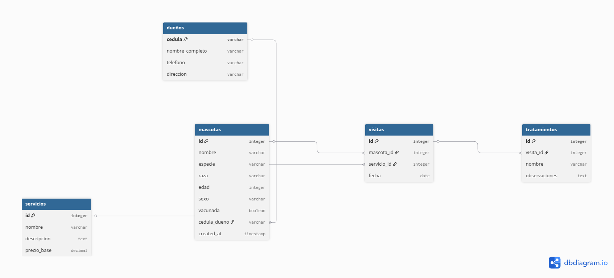

# Proyecto Base de Datos: Veterinaria "Mi Mejor Amigo" 🐾

Este repositorio contiene la implementación de una base de datos para la veterinaria "Mi Mejor Amigo", diseñada para optimizar el registro y la gestión de sus operaciones diarias, incluyendo información de dueños, mascotas, servicios, visitas y tratamientos. 🏥

## Contexto del Proyecto

La veterinaria "Mi Mejor Amigo" necesitaba una solución para organizar de manera eficiente la información de sus clientes y servicios. Este proyecto aborda esa necesidad mediante la creación de un sistema de base de datos relacional que permite un seguimiento detallado de cada aspecto de la atención a las mascotas. 📊

## Requerimientos Funcionales

La base de datos está diseñada para gestionar la siguiente información clave:

* **Dueños de Mascotas:** 🧑‍🦱 Registro de cédula, nombre completo, teléfono y dirección. Un dueño puede tener múltiples mascotas. 🏡
* **Mascotas:** 🐶🐱 Cada mascota debe tener registrado: nombre, especie (perro, gato, etc.), raza, edad, sexo y si está vacunada. Cada mascota pertenece a un solo dueño. 💉
* **Servicios:** 🛁 La veterinaria ofrece servicios como: baño, corte de uñas, consulta médica, desparasitación, vacunación, entre otros. Cada servicio tiene un nombre, una descripción y un precio base. 💰
* **Visitas:** 📅 Cuando una mascota es llevada a la veterinaria, se registra una visita. Cada visita está asociada a una mascota, un servicio recibido y una fecha. En una visita solo se realiza un servicio. Se necesita poder ver el historial de visitas de cada mascota. 📝
* **Tratamientos:** 💊 En algunas visitas, el veterinario receta uno o más tratamientos. Un tratamiento tiene: nombre, observaciones y está vinculado a una visita. 🩺

## Entregables

Este repositorio incluye los siguientes archivos, cumpliendo con los requerimientos del proyecto:

### 1. Diagrama UML E-R 🗺️




El diagrama de Entidad-Relación (E-R) modela la estructura de la base de datos, mostrando las 5 entidades principales (`dueños`, `mascotas`, `servicios`, `visitas`, `tratamientos`), sus atributos, llaves primarias, llaves foráneas y las cardinalidades de las relaciones. Fue creado utilizando `dbdiagram.io`.

### 2. Archivo DDL (estructura.sql) 🏗️

Este archivo contiene las instrucciones SQL (`CREATE TABLE`) para definir la estructura de todas las tablas de la base de datos. Incluye la especificación de llaves primarias (`PRIMARY KEY`), llaves foráneas (`FOREIGN KEY`) para establecer las relaciones entre tablas, y otras restricciones básicas como `NOT NULL` y `AUTO_INCREMENT`.

### 3. Archivo DML (datos.sql) ➕

Este archivo contiene las instrucciones SQL (`INSERT INTO`) para poblar la base de datos con datos de ejemplo. Se han insertado los siguientes registros mínimos:

* 5 Dueños 🧑‍🦱
* 10 Mascotas 🐶
* 5 Servicios 🛁
* 10 Visitas 📅
* 5 Tratamientos 💊

### 4. Archivo DQL (consultas.sql) 🔍

Este archivo presenta un conjunto de **15 consultas SQL** que demuestran la capacidad de la base de datos para recuperar y manipular información. Las consultas incluyen ejemplos de:

* Creación de tablas a partir de consultas (`CREATE TABLE AS SELECT`).
* Uso de **Alias** en campos y subconsultas.
* **Funciones de agregación** (`COUNT`, `AVG`, `MIN`, `MAX`).
* **Funciones de cadena** (`CONCAT`, `UPPER`, `LOWER`, `LENGTH`, `SUBSTRING`, `TRIM`).
* Uso de **`CASE`** (simulando `IF` en SQL estándar) en campos.
* Consultas con **`JOIN`** para combinar datos de múltiples tablas.
* Consultas con **`GROUP BY`** y **`HAVING`** para agrupar y filtrar resultados.
* **Subconsultas** para consultas anidadas.
* Uso de **`ORDER BY`** para ordenar resultados.

## Proceso de Implementación 🛠️

1.  **Diseño del Modelo E-R:** Se definió la estructura de la base de datos y las relaciones entre entidades, plasmado en el diagrama UML E-R. 📝
2.  **Definición de la Estructura (DDL):** Se crearon las tablas con sus atributos, llaves y restricciones utilizando SQL. 🏗️
3.  **Inserción de Datos (DML):** Se poblaron las tablas con datos de ejemplo para simular un escenario real. ➕
4.  **Desarrollo de Consultas (DQL):** Se elaboraron las consultas para extraer información relevante y demostrar la funcionalidad de la base de datos. 🔍

## Video Explicación de Consultas 🎬

\[**¡Inserta aquí el enlace a tu video de YouTube/Vimeo/etc. explicando las consultas!**]

## Configuración y Uso ⚙️

Para configurar y utilizar esta base de datos:

1.  **Clona el repositorio:**
    ```bash
    git clone <URL_DEL_REPOSITORIO>
    cd veterinaria-mi-mejor-amigo
    ```
2.  **Crea la base de datos:** Utiliza un sistema de gestión de bases de datos (ej. MySQL, PostgreSQL). 💾
3.  **Ejecuta `estructura.sql`:** Importa este archivo en tu gestor de base de datos para crear las tablas. 🚀
4.  **Ejecuta `datos.sql`:** Importa este archivo para insertar los datos de ejemplo. 📥
5.  **Ejecuta `consultas.sql`:** Puedes ejecutar las consultas individualmente en tu gestor de base de datos para ver los resultados. ✅
